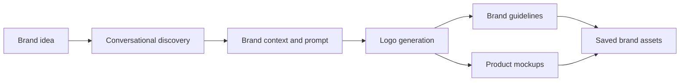
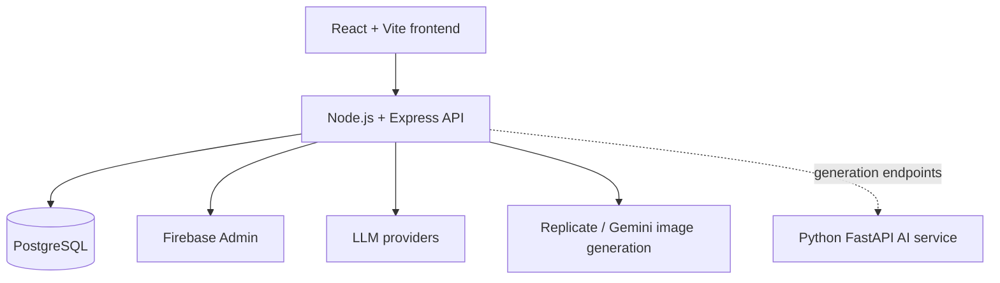

# BrandyBot

### From a business idea to a brand identity, in one guided workspace.

BrandyBot is an AI-assisted branding platform for discovering a brand's personality, generating logo concepts, creating brand guidelines, and previewing designs on product mockups. A conversational agent guides the process, while a credit system manages generation usage.

[System report](docs/overall_brandybot_system_report.md) · [Backend guide](backend/README.md) · [Brand showcase](frontend/public/showcase/)

---

## What You Can Do

| Explore | Create | Apply |
| --- | --- | --- |
| Describe your business in chat | Generate logo concepts from brand context | Preview identity on product mockups |
| Refine industry, audience, and tone | Build color and typography guidance | Review saved logos and brand assets |
| Iterate on a visual direction | Export brand guidelines as PDF | Manage account and generation credits |

## Product Flow



## Architecture



The backend coordinates authentication, user and credit rules, chat sessions, generation, and persistence. The Python FastAPI service provides a separate home for AI endpoints and generated assets.

## Code Map

| Area | Main implementation |
| --- | --- |
| Frontend routes and protected screens | [frontend/src/App.jsx](frontend/src/App.jsx) |
| API startup, middleware, route registration | [backend/server.js](backend/server.js) |
| Chat-led logo generation workflow | [backend/controllers/logoAgentController.js](backend/controllers/logoAgentController.js) |
| Brand conversation and LLM integrations | [backend/services/llmService.js](backend/services/llmService.js) |
| Logo generation and provider fallback | [backend/services/aiService.js](backend/services/aiService.js) |
| Credits and transactions | [backend/controllers/creditController.js](backend/controllers/creditController.js) |
| PostgreSQL connection | [backend/config/db.js](backend/config/db.js) |
| Python AI service entry point | [ai-service/main.py](ai-service/main.py) |

## Technology

- **Web app:** React 19, Vite, React Router, Framer Motion, Three.js / React Three Fiber
- **API:** Node.js, Express 5
- **Data and identity:** PostgreSQL, Firebase Admin SDK
- **AI integrations:** Gemini, Groq, OpenRouter, OpenAI, and Replicate
- **Brand guideline PDF:** jsPDF
- **Optional AI microservice:** Python, FastAPI

## Run Locally

### Requirements

- Node.js and npm
- PostgreSQL database and a `DATABASE_URL`
- Firebase credentials and the API keys for the AI providers you intend to use

Some integrations are optional depending on the workflow. Configure secrets in local environment files; never commit API keys or credentials.

### 1. Start the backend

```powershell
cd backend
npm install
# Create backend/.env and configure DATABASE_URL, Firebase, and provider settings.
npm run dev
```

The API uses port `5000` by default. Check `/health` to verify the server is responding.

### 2. Start the frontend

In a second terminal:

```powershell
cd frontend
npm install
# Configure the frontend API URL in the local Vite environment.

```

Vite prints the local URL when it starts. Use the API URL expected by the frontend configuration and backend CORS settings.

### 3. Optional: start the Python AI service

In another terminal, install the packages from `ai-service/requirements.txt`, configure the service environment, and run:

```powershell
cd ai-service
python -m pip install -r requirements.txt
python main.py
```

The service runs on port `8000` by default. The backend can be configured to reach it with `AI_SERVICE_URL`.

## Project Layout

```text
brandybot/
├── ai-service/   Python FastAPI generation service
├── backend/      Express API, controllers, services, and tests
├── docs/         System and feature documentation
└── frontend/     React application and showcase assets
```

## Documentation

- [Overall system report](docs/overall_brandybot_system_report.md)
- [Backend setup and API notes](backend/README.md)
- [Mockup generator report](docs/mockup_generator_report.md.resolved)
- [Mockup model improvement notes](MOCKUP_MODELS_IMPROVEMENT_PROMPT.md)

## Contributing

1. Create a focused branch for your change.
2. Keep credentials and local environment files out of commits.
3. Run the relevant checks before opening a pull request.
4. Describe user-visible behavior and note any setup changes.

---

<p align="center">Built for founders, makers, and teams bringing new ideas to life.</p>
