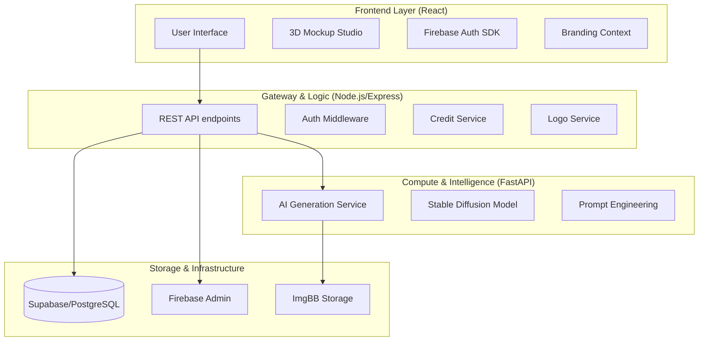
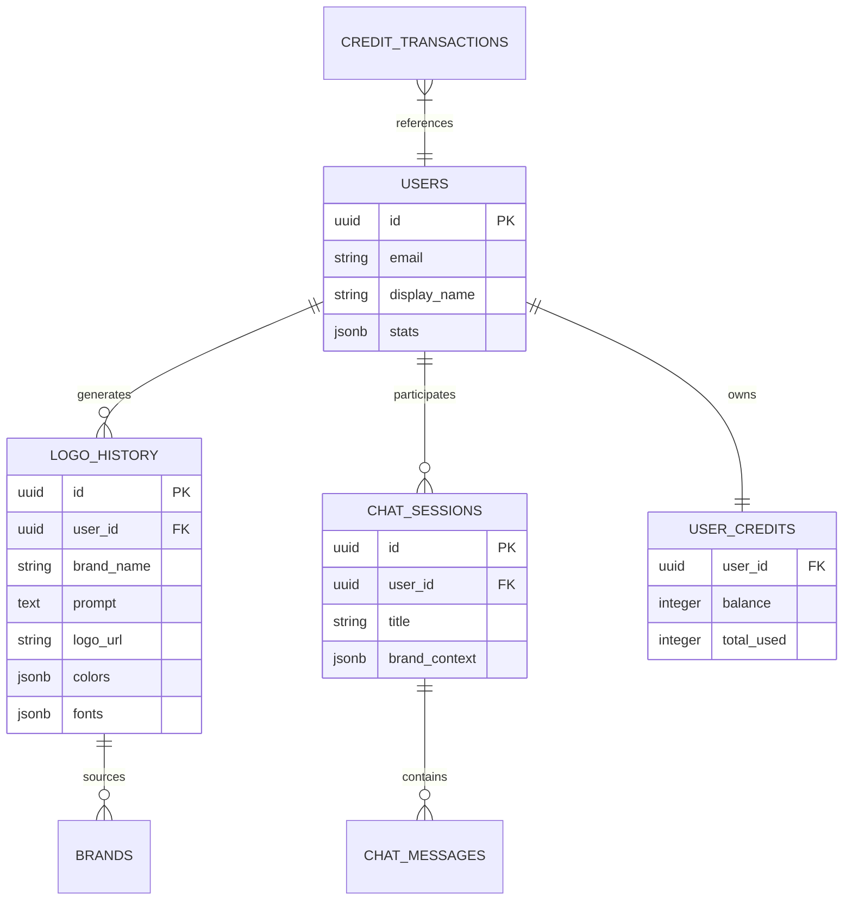

# BrandyBot – Professional System Architecture & Technical Report

## 1. Executive Summary
**BrandyBot** is a state-of-the-art AI-powered branding ecosystem. It automates the transition from a conceptual business idea to a fully realized visual identity. By combining conversational LLMs with Stable Diffusion image generation and high-fidelity 3D rendering, BrandyBot provides professional-grade branding assets at a fraction of the traditional cost and time.

---

## 2. System Architecture
BrandyBot utilizes a **Decoupled Three-Tier Architecture** designed for high performance and scalability.

### Key Architectural Patterns:
- **Client-Server Separation**: Ensures a responsive UI while offloading complex generation tasks to specialized servers.
- **Atomic Credit Transactions**: Uses PostgreSQL transactions to ensure credit deduction and logo generation are always in sync.
- **Model Isolation**: The Python-based AI service is isolated from the main backend, allowing it to be scaled independently on GPU-enabled nodes in the future.

---

## 3. Detailed Technology Stack

| Component | Technology | Role |
| :--- | :--- | :--- |
| **Frontend** | React 19 (Vite) | Main application framework |
| **Styling** | Vanilla CSS + Tailwind | Premium, responsive design system |
| **3D Rendering** | Three.js + R3F | High-fidelity interactive mockup studio |
| **Backend** | Node.js (Express) | Business logic and API gateway |
| **Database** | PostgreSQL (Supabase) | Relational data persistence |
| **AI Layer** | Python (FastAPI) | High-performance AI service API |
| **Authentication** | Firebase | Industry-standard identity management |
| **Image Storage** | ImgBB | Cloud-based asset hosting |
| **Animation** | Framer Motion | Fluid UI transitions and micro-interactions |

---

## 4. Database Schema (ERD)
The system leverages a relational model to maintain strict relationships between users, their conversations, and their generated branding assets.

### Logical Distribution:
- **`logo_history`**: Stores every generated variant, including metadata like AI prompts, extracted color hex codes, and font choices.
- **`user_credits`**: Managed using atomic `UPDATE` queries to prevent race conditions during concurrent generations.
- **`chat_messages`**: Specifically tracks AI "actions" (like `generate_logo`) to maintain a history of why assets were created.

---

## 5. Core Feature Deep Dive

### A. Conversational Logo Agent
Unlike traditional form-based generators, BrandyBot uses a recursive conversational agent:
1.  **Context Harvesting**: The agent uses an LLM (Gemini/Groq) to naturally extract industry, audience, and personality details.
2.  **Prompt Engineering**: Once context is complete, a specialized LLM service translates business values into visual descriptors (e.g., "minimalist", "geometric", "sophisticated").
3.  **Variant Generation**: Stable Diffusion renders multiple variants (e.g., modern, gradient, line-art) to give the user diverse creative options.

### B. High-Fidelity 3D Mockup Studio
Implemented using **Three.js** and **React Three Fiber (R3F)**, this module transforms flat 2D logos into realistic spatial previews:
-   **Dynamic Texturing**: 2D logo images are converted into 3D textures and projected onto meshes with custom UV mapping.
-   **Real-time Interaction**: Users can orbit, pan, and zoom around products like coffee mugs and t-shirts.
-   **Lighting & Shading**: Uses PBR (Physically Based Rendering) materials to simulate sunlight reflections and material roughness for a "premium" feel.

---

## 6. Security & Infrastructure
-   **Firebase-Node Handshake**: The application uses Firebase on the client to get an ID token. This token is verified by the Node.js backend using the `firebase-admin` SDK, ensuring that every API request is authenticated.
-   **Rate Limiting**: Specifically configured for Guest Users using IP-based fingerprints to prevent bot-based credit exhaustion.

---

## 7. Business Metrics & Pricing
BrandyBot operates on a credit-based SaaS model designed for low-friction entry and scalable professional use.

| Tier | Price | Credits | Best For |
| :--- | :--- | :--- | :--- |
| **Free Sign-up** | $0.00 | 50 Credits | Concept exploration |
| **Starter Pack** | $4.99 | 150 Credits | Single brand project |
| **Pro Pack** | $9.99 | 500 Credits | Multiple brand identities |
| **Unlimited** | $24.99 | 2000 Credits | Agencies and frequent users |

*Note: Each logo generation (4 variants) costs approximately 1-2 credits depending on the complexity of the prompt enhancement.*

---

## 8. Future Roadmap

### Short-Term (0-3 Months)
-   **Direct SVG Vectorization**: Implement real-time tracing to provide high-quality vector downloads.
-   **AI Chatbot Expansion**: Upgrade the chatbot to provide business name suggestions and domain availability checks.

### Medium-Term (3-6 Months)
-   **GPU Cloud Integration**: Transition from simulated inference to dedicated H100 GPU clusters for sub-5-second logo generation.
-   **Multi-User Workspaces**: Collaboration tools for teams to vote on brand guidelines.

---

## 9. Conclusion
BrandyBot is not just a logo maker; it is a **Branding-as-a-Service (BaaS)** platform. Its architecture reflects a modern commitment to AI-driven automation, high-end 3D visualization, and robust data integrity, making it highly competitive in the automated design market.

---
**Prepared by Antigravity AI**
